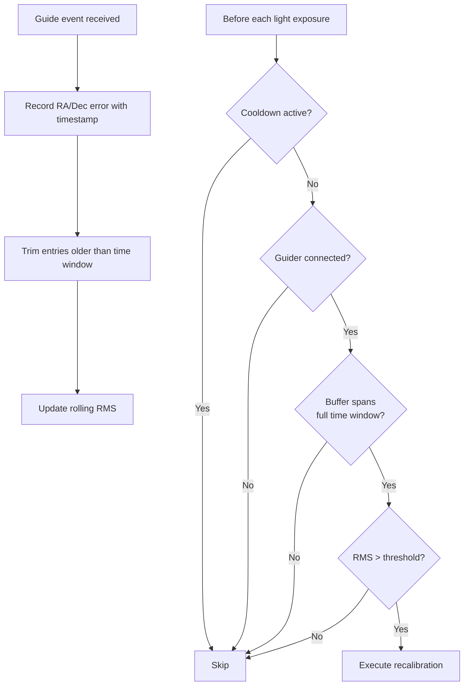
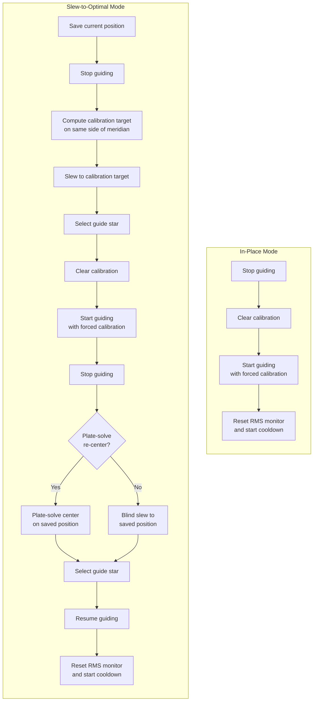

# Triggers

A plugin for N.I.N.A. (Nighttime Imaging 'N' Astronomy) that provides sequencer triggers for automated equipment management during imaging sessions.

## Triggers

### Recalibrate Guider

Monitors guiding RMS error and automatically recalibrates the guider when the error exceeds a configurable threshold. This is useful when guiding degrades over the course of a session due to meridian flips, temperature changes, or flexure.

#### How It Works

The trigger subscribes to guide events (e.g., from PHD2) and maintains a rolling time window of guiding error data. Before each light exposure, it evaluates the RMS error over that window and initiates recalibration if the threshold is exceeded.



#### Calibration Modes

The trigger supports two calibration modes: in-place and slew-to-optimal.

**In-place mode** calibrates at the current telescope position. This is simpler and faster, but the calibration quality depends on the current sky position — calibration near the celestial poles is less accurate.

**Slew-to-optimal mode** moves the telescope to a position near the meridian at a configurable declination (ideally near 0°), calibrates there for best accuracy, and returns to the original target. This produces the most accurate guider calibration but takes longer and briefly interrupts imaging.



#### Settings

| Setting | Default | Description |
|---|---|---|
| **Axis** | Total | Which guiding error axis to monitor: Total (RA + Dec combined), RA only, or Dec only |
| **Time window** | 5 min | Duration of the rolling window used to compute RMS. The trigger waits for this window to fill before evaluating. |
| **Threshold** | 3.0 arcsec | RMS error threshold. Recalibration triggers when the RMS exceeds this value. |
| **Slew to optimal** | Off | When enabled, slews to an optimal sky position for calibration instead of calibrating in place. |
| **Calibration Dec** | 0° | Declination for the calibration position (slew mode only). Near-zero declination provides the most accurate calibration. |
| **Meridian offset** | 5° | Degrees from the meridian for the calibration position (slew mode only). The calibration target is automatically placed on the same side of the meridian as the current pointing direction to avoid a pier flip. |
| **Plate-solve re-center** | On | When enabled, uses iterative plate-solve centering after returning to the original target (slew mode only). When disabled, returns with a blind slew. |
| **Cooldown** | 30 min | Minimum time to wait after a recalibration before triggering again. |

#### Tips

- Start with a conservative threshold (e.g., 3–5 arcsec) and lower it as you learn your system's typical RMS.
- A longer time window (e.g., 10 min) reduces false triggers from brief guiding disturbances like wind gusts.
- If using slew-to-optimal mode, keep the meridian offset small (5–10°) to avoid unnecessary pier flips on a GEM.
- The cooldown prevents cascading recalibrations if guiding is persistently poor — it gives the new calibration time to take effect.

## Localization

The plugin UI and messages support 28 locales. The language is automatically selected based on N.I.N.A.'s UI culture setting.

Arabic (ar-SA), Basque (eu-ES), Catalan (ca-ES), Chinese Simplified (zh-CN), Chinese Traditional (zh-HK, zh-TW), Czech (cs-CZ), Danish (da-DK), Dutch (nl-NL), English (default, en-GB), French (fr-CA, fr-FR), Galician (gl-ES), German (de-DE), Greek (el-GR), Hungarian (hu-HU), Italian (it-IT), Japanese (ja-JP), Korean (ko-KR), Norwegian Bokmål (nb-NO), Polish (pl-PL), Portuguese (pt-PT), Russian (ru-RU), Spanish (es-ES), Swedish (sv-SE), Turkish (tr-TR), Ukrainian (uk-UA)

## Requirements

- N.I.N.A. 3.0.0.2017 or later
- A guider application (e.g., PHD2) connected via N.I.N.A.

## Installation

1. Build the project or download the release DLL
2. Copy `Triggers.dll` to `%localappdata%\NINA\Plugins\3.0.0\Triggers\`
3. Restart N.I.N.A.
4. The trigger will appear in the Advanced Sequencer under the Guider category

## Building

```bash
cd Triggers/Triggers
dotnet build -c Release
```

The built DLL will be in `bin/Debug/net8.0-windows/` or `bin/Release/net8.0-windows/`.

## License

MPL-2.0
